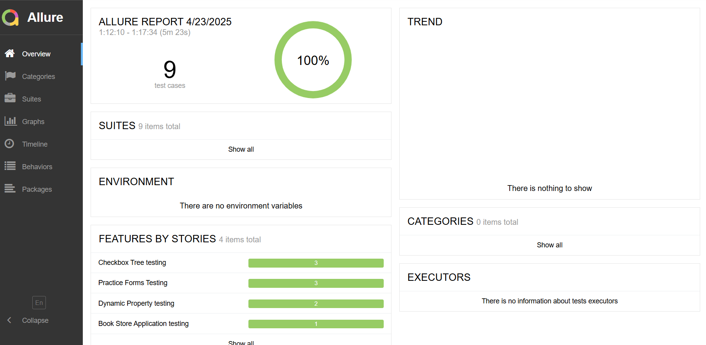

# Automation Framework (Python + Selenium + Behave)
A robust and scalable test automation framework built using Python, Selenium, and Behave (BDD).
Designed with maintainability and extensibility in mind, this framework leverages modern automation best practices and tools to ensure efficient test development and execution.

### ✨ Key Features
- **Behavior-Driven Development (BDD)** with Behave for clear and collaborative test scenarios.
- **Page Object Model (POM)** design pattern for better organization and reusability of page elements and actions.
- **Resuable Step Definitions** to minimize redundancy and improve maintainability.
- **Organized Page Handlers** to abstract UI logic and reduce redundant code.
- **Dynamic XPath Handling** to avoid hard-coded selectors and improve resilience against UI changes.
- **Reusability-First Design** ensuring that all components are designed for reuse across different test cases.


### 💡 Good to haves implemented
- **Custom Logging** for detailed test execution logs, making debugging easier.
- **Allure Reporting** for generating comprehensive and visually appealing test reports.
- **Invoke CLI Integration** to simplify and streamline test execution from the command line

---

### 🛠️ Tech Stack
- **Language:** Python 3.8+
- **Automation:** Selenium WebDriver
- **BDD:** Behave
- **Reporting:** Allure
- **CLI Task Runner:** Invoke
- **Logging:** Python's built-in `logging` module

---

## 📁 Project Structure
```
/demoqa_automation
├── features/              # Main project directory
│   ├── steps/             # Step definitions for Behave
│   │   ├── base_steps.py  # Step definitions for common functionalities
│   │   ├── book_store_steps.py  # Step definitions for Book Store tests
│   │   ├── checkbox_steps.py  # Step definitions for Checkbox tests
│   │   ├── dynamic_properties_steps.py  # Step definitions for Dynamic Properties tests
│   │   ├── forms_steps.py  # Step definitions for form related tests
│   ├── book_store.feature  # Test cases in Gherkin format for Book Store
│   ├── checkbox.feature    # Test cases in Gherkin format for Checkbox
│   ├── dynamic_properties.feature  # Test cases in Gherkin format for Dynamic Properties
│   ├── forms.feature       # Test cases in Gherkin format for Forms
│   ├── environment.py   # Consists of hooks for Behave
├── pages  # Page Object Model (POM) implementation
│   ├── base_page.py        # Common methods for all pages
│   ├── book_store_page.py  # Page class for Book Store related locator variables and methods
│   ├── checkbox_page.py    # Page class for Checkbox related locator variables and methods
│   ├── dynamic_properties_page.py    # Page class for Dynamic Properties related locator variables and methods
│   ├── forms_page.py    # Page class for Forms related locator variables and methods
├── utils   # Utility modules and helper functions
│   ├── logger.py           # Custom logging utility
│   ├── page_manager.py     # Page manager to handle page object instantiation
├── logs   # Captures and stores logs
│   ├── run.log  # Captures test execution logs
├── reports   # Folder to capture allure report related details
│   ├── allure-results/  # Allure results folder
│   ├── allure-report/   # Allure report folder
├── .gitignore           # Git ignore file
├── requirements.txt  # List of dependencies
├── tasks.py  # Invoke tasks for running tests
├── README.md          # Project documentation
└── miscellaneous            # miscellaneous files
     ├── Execution_report_snapshot.PNG 
```

```

---
## 🧩 Traceability Matrix

| Requirement ID | Description                                                                                                                 | Test Case ID | 🟢 Additional detailing covered in test cases                                                                                                                        |
|----------------|-----------------------------------------------------------------------------------------------------------------------------|--------------|----------------------------------------------------------------------------------------------------------------------------------------------------------------------|
| REQ-1.a        | **Navigate to Elements > Checkbox**. Dynamically expand the tree at all levels.                                             | TC001        | Expands the tree through (+) icon                                                                                                                                    |
| REQ-1.b        | Tick a parent node (of your choosing) and dynamically assert that all nested elements have correct icons                    | TC002        | Expands the tree through arrow icons through code. Works for any **parent** node in the tree. Validates both **fully-ticked** and **half-ticked** nodes accordingly. |
| REQ-2.a        | **Navigate to Elements > Dynamic Properties**. Fluently wait for button with text “Visible after 5 seconds” to be displayed | TC003        | Explicit waits through polling                                                                                                                                       |
| REQ-2.b        | Load the page and verify that the second button changes color after some time                                               | TC004        | Validation of CSS color property along with waits                                                                                                                    |
| REQ-3          | **Navigate to Forms > Practice Forms**.Identify and implement 1-2 test scenarios to test field validatio                    | TC005, TC006, TC007 | Covered positive and negative scenarios for, mandatory form fields,  Mobile number field and Email-ID field. Also ID look-up table implemented.                      |
| REQ-4         | **Navigate to Book Store Application** Look at the list of books and use the api to validate the correctness of the data displayed on the book store page        | TC008       | Pagination handled. Works even when records are spread over multiple pages. Dynamically compares between displayed books through UI and that fetched from API.       |

## ⚙️ Pre-requisites and set up 
**Disclaimer:** Assuming that **windows** is being used as the OS, below are the pre-requisites to set up the project.

### 1️⃣ Navigate to project directory:
```bash
cd demoqa_automation
```
### 2️⃣ Python Installation
Check if **Python 3.8+** is installed. Verify python version by executing:
```bash
python --version
```
### 3️⃣ Check and upgrade `pip`

Ensure your `pip` version is **24.0.0 or higher** before installing dependencies.

#### 🔍 Check current `pip` version:
```bash
pip --version
```
#### 🔄 Upgrade `pip` if necessary:
```bash
python -m pip install --upgrade pip
```


### 4️⃣ Set up virtual environment
Create a virtual environment to isolate project dependencies:
```bash
python -m venv venv  # Create virtual environment
venv\Scripts\activate.bat  # Activation command
```
### 5️⃣ Install required packages
Make sure you have **pip** installed.
Run the following command to install required packages:
```bash
pip install -r requirements.txt
```

---

## ▶️ Execution steps
For the ease of execution, python **invoke** package is used to run the tests.

### 🔁 To run all tests
```bash
invoke run-tests
```

### 📄To run specific feature file
```bash
invoke run-tests --features="features/book_store.feature"
```
```bash
invoke run-tests --features="features/checkbox.feature"
```
```bash
invoke run-tests --features="features/dynamic_properties.feature"
```
```bash
invoke run-tests --features="features/forms.feature"
```

### 📊 To generate allure report
In order to generate allure report, the **allure CLI** needs to be set up in your system.
#### ✅ Check if allure CLI is installed
```bash
allure --version
```
If you see version output, hurray! No additional steps required. Execute the following command to generate allure report.
#### 🟢 Generate Allure Report
```bash
invoke report
```

🔴 If allure CLI is not installed. You could do the following steps to install teh same.
#### 🛠️ Allure CLI Installation on Windows
* Download Allure CLI from https://github.com/allure-framework/allure2/releases
* Download the .zip from the latest release.
* Extract the ZIP to a permanent folder (e.g., C:\allure)
* Add to PATH
* Open Windows search → search Environment Variables
* Click Environment Variables
* Under System variables or User variables, find the Path variable → click Edit
* Add the path to the bin folder inside your extracted allure directory (e.g., C:\allure\bin)
* Click OK to save everything
* Verify if allure is installed by opening a **new terminal** and then run the report generation command mentioned **above**.

---
### Allure execution report



---